# NetSpider

**NetSpider** is a network diagnostic tool for Windows that works at Layer 2 and Layer 3. Built with C# / .NET 10 / Avalonia 11. It:

- finds every device on your network and identifies it
- measures latency at the MAC level (ARP/NDP) and the IP level (ICMP/TCP), including device↔device timing
- continuously answers one question: **where exactly does it break?**

Results appear as a live, animated spider-web graph.

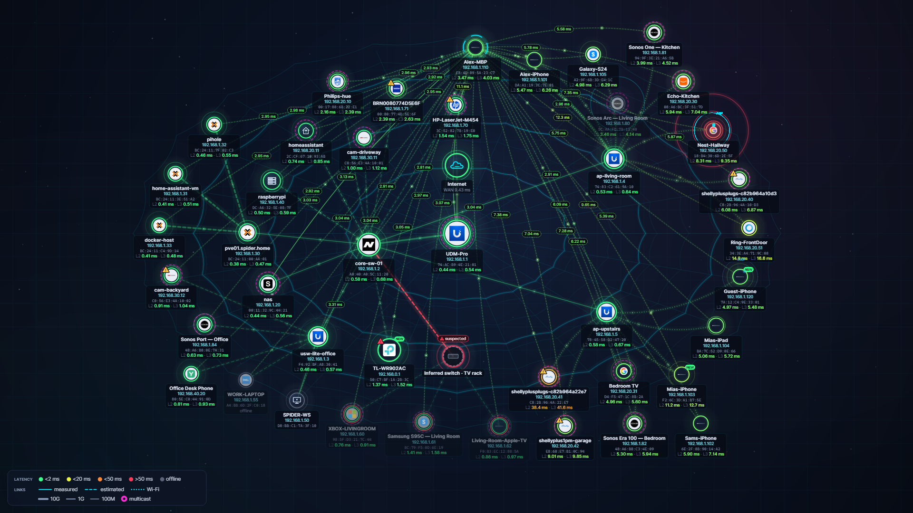

NetSpider is part of the **[FreeSense](https://freesense.org)** project.

## Download
**[⬇ Download the latest release](https://github.com/FreeSense-org/NetSpider/releases/latest)**

First choose your architecture:

| Architecture | For |
|---|---|
| `win-x64` | Most Windows 10/11 PCs (Intel/AMD 64-bit) |
| `win-arm64` | Windows on ARM (Snapdragon and other ARM laptops) |
| `win-x86` | 32-bit Windows 10 only |

Then choose a package:

| File | Use it when |
|---|---|
| `FreeSense-NetSpider-<version>-<arch>-Setup.exe` | **Recommended.** Per-user install with Start menu and desktop shortcuts. **Updates itself automatically**, and no admin rights are needed to install. |
| `FreeSense-NetSpider-<version>-<arch>-PreRelease-Setup.exe` | The same installer, but the installed copy follows the **Pre-release** channel: early builds plus every release. |
| `FreeSense-NetSpider-<version>-<arch>-Standalone.exe` | **Standalone:** a single exe with nothing to install. Run it from anywhere, even a USB stick. NetSpider tells you when a new version exists; updates are manual. |
| `FreeSense-NetSpider-<version>-<arch>.msi` | **IT / managed deployment** (Intune, GPO, SCCM). Installs machine-wide to `Program Files\FreeSense\NetSpider`. Silent install: `msiexec /i <file>.msi /qn`. It doesn't update itself; deploy the newer MSI to upgrade. |
| `FreeSense-NetSpider-<version>-<arch>-Portable.zip` | No install: unzip and run. Updates are manual. |
| `FreeSense-NetSpider-Probe-<version>-<rid>.zip` | Optional headless **probe agent**, giving a second vantage point (Windows x64/ARM64/x86, Linux x64/ARM64). |

The `*.nupkg`, `releases.*.json` and `assets.*.json` files are the auto-update feed; you don't need to download them. `SHA256SUMS.txt` lists checksums for every file.

Other notes:
- **Npcap:** NetSpider needs **[Npcap](https://npcap.com)**, which isn't bundled because its license doesn't allow it. On first start NetSpider detects whether it's missing and guides you through installing it.
- **Administrator rights:** NetSpider asks for them at launch, because raw packet capture needs them.
- **Unsigned builds:** the builds aren't code-signed yet, so SmartScreen may show "Windows protected your PC". Choose **More info → Run anyway**.
- **Release channels:**
  - **Release** (default): tested versions only.
  - **Pre-release:** early builds (e.g. `1.3.0-pre.1`), plus every release.
  - **Switching:** tick **Settings → Updates → "Also receive pre-releases"**, or install with the `PreRelease-Setup.exe`.

## Highlights

**Discovery and identification**
- ARP and IPv6 neighbor-discovery sweeps with real L2 round-trip times, taken from Npcap high-precision timestamps.
- Every common discovery protocol: LLDP (802.1/802.3/MED), CDP, STP/RSTP/MSTP/PVST+, DHCP fingerprinting, mDNS/DNS-SD, SSDP/UPnP, WS-Discovery/ONVIF, NetBIOS/LLMNR, SMB2/3 (operating system and domain), SNMP v1/v2c/v3, TLS certificate inspection and port scanning with banner grabbing.
- Vendor-specific protocols: Ubiquiti, MikroTik MNDP, Netgear NSDP, plus Sonos, Hue, Chromecast, Shelly, Tasmota, Fritz!Box, Plex and Home Assistant APIs, MQTT and CoAP.
- An offline IEEE MAC-vendor database, an evidence-based classifier with about 170 brand rules, and brand logos scraped from vendor websites.
- Other subnets and VLANs: found through the route table, DHCP option 121, traceroute, SNMP and tagged DHCP probes.
- Nearby Wi-Fi networks: SSIDs, channels and signal strength.

**Path Doctor: where does it break?**
- A continuous hop-by-hop monitor from this PC through APs, switches (including inferred unmanaged ones), the router, the ISP modem and the ISP hops to the internet. Each hop shows its latency, the latency it adds, packet loss, jitter and ARP-vs-ICMP results.
- A fault locator that combines the first failing hop, the *lowest common ancestor* of every device that dropped at the same time, switch-port evidence and storm/loop state into **incidents** with a root-cause sentence and a confidence. Example: *"Inferred switch 'TV rack' or its uplink to core-sw-01 port 7 — 3 devices unreachable — 78 %"*.
- Own-link detection: an unplugged cable, the speed dropping to 100 Mbps, DHCP lease loss, or a gateway MAC change.

**Switch ports, storms and loops**
- SNMP port counters: CRC/FCS errors, link flaps, duplex mismatch, speed downgrades and PoE.
- **Storm Center**: live broadcast, multicast and unknown-unicast levels against a learned baseline, the top sources mapped to their **switch and port**, the ingress port, a loop finder, storm history and pcapng recording.
- An opt-in storm-control check: a short, rate-capped broadcast burst that is only sent after you confirm.

**Wi-Fi ↔ LAN**
- Wi-Fi link telemetry for this PC: RSSI, link rate, roams and disconnect reasons. The AP and the gateway are pinged separately, which separates the radio hop from the backhaul.
- Per-AP health from the wired side. Example: *"AP up but its clients unreachable → radio/SSID problem"*.
- **Dual-interface self-test**: a PC that has both LAN and Wi-Fi tests each side separately. It measures true **one-way latency** across switch → AP and back by injecting frames on one adapter and catching them on the other.
- **`netspider-probe`**: a small signed-report agent for a second PC or a Raspberry Pi, giving you a second vantage point. See [src/NetSpider.Probe](src/NetSpider.Probe/README.md).

**More**
- An opt-in internet monitor that pings any targets you choose and records outage history.
- A health score covering DNS, MTU black holes, bufferbloat, cleartext management, expired certificates, SMBv1 and rogue DHCP/RA.
- Live MTR, Wake-on-LAN, and SSH/RDP/Web UI launchers.
- Exports: JSON, CSV, Nmap XML, a self-contained HTML report and pcapng.
- Alerts can go to Discord, Slack or JSON webhooks, or to syslog.

## Screenshots
| | |
|---|---|
| 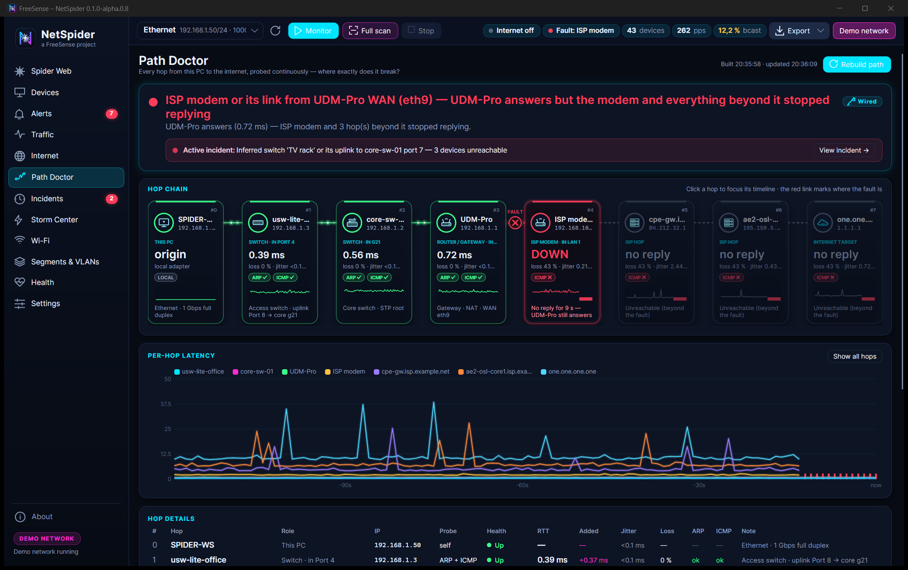 | 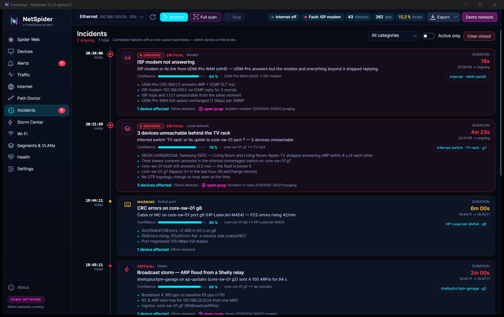 |
| 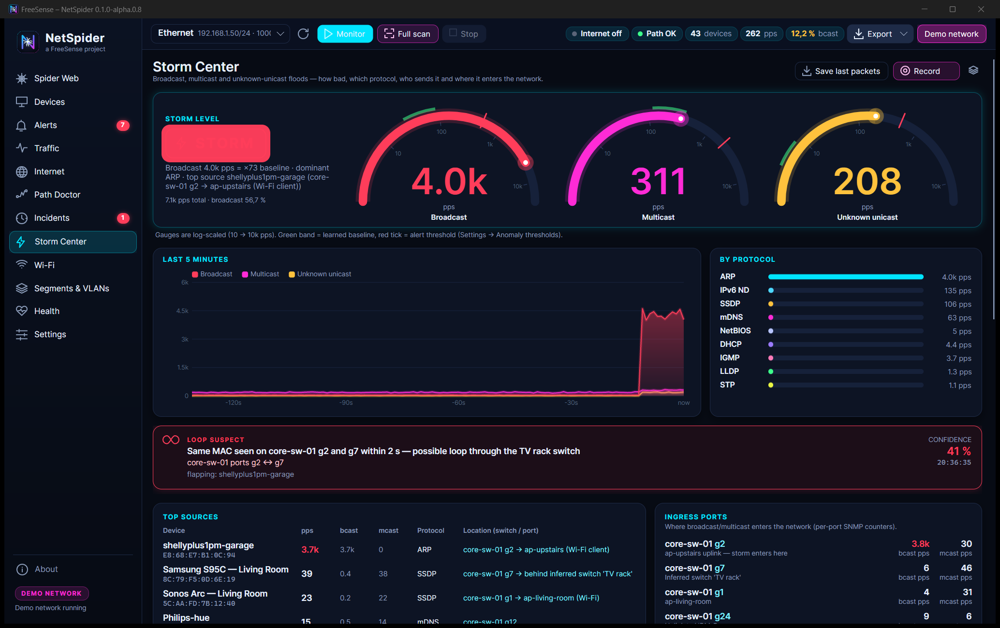 | 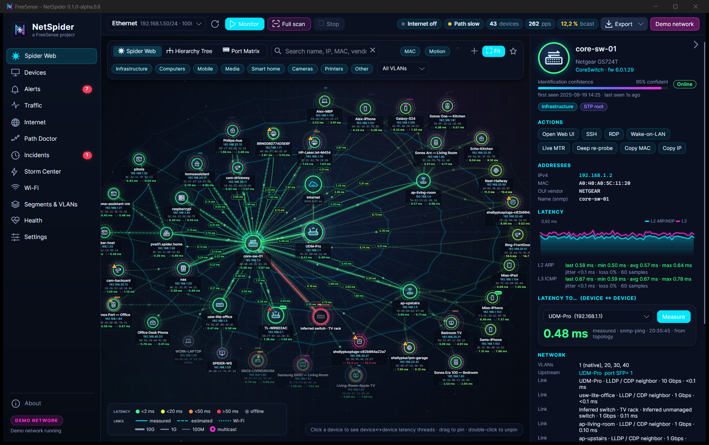 |
| 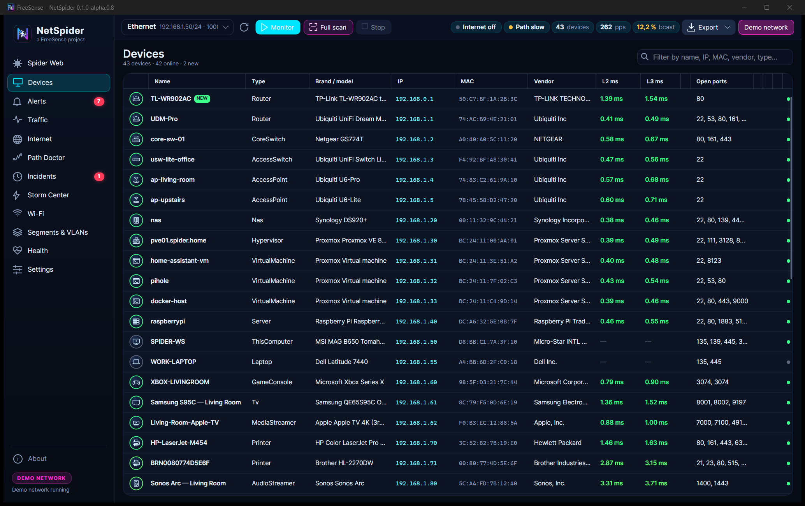 | 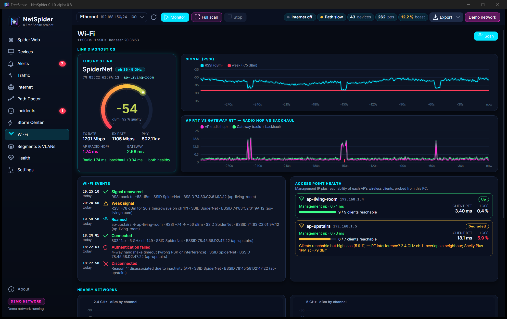 |
| 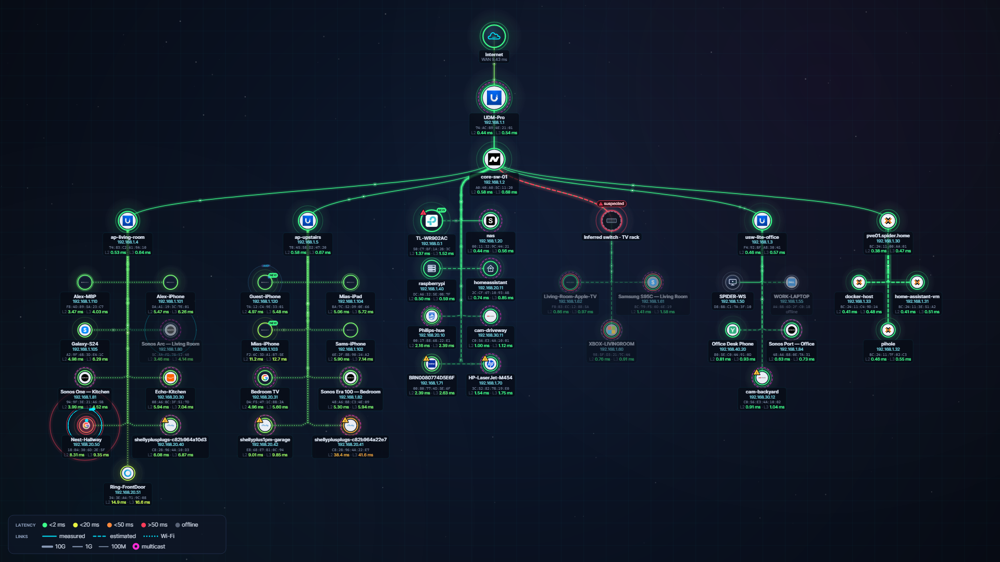 | 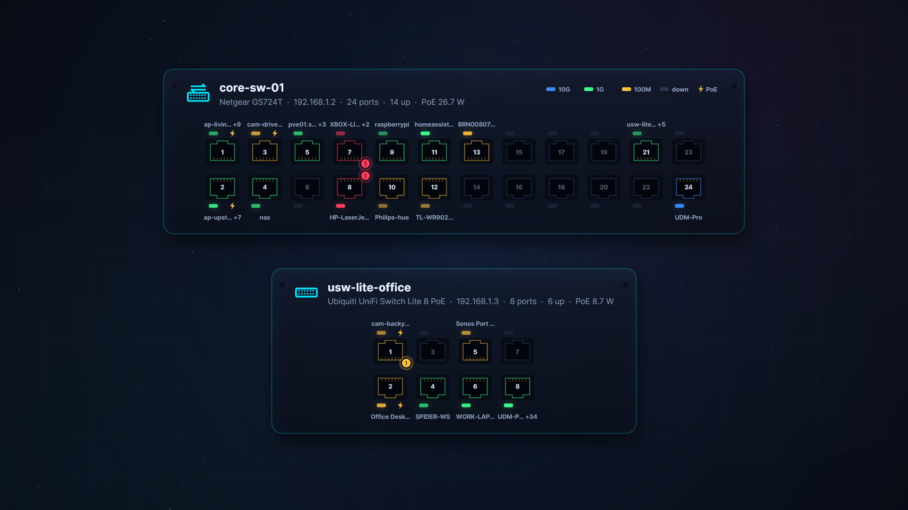 |
| 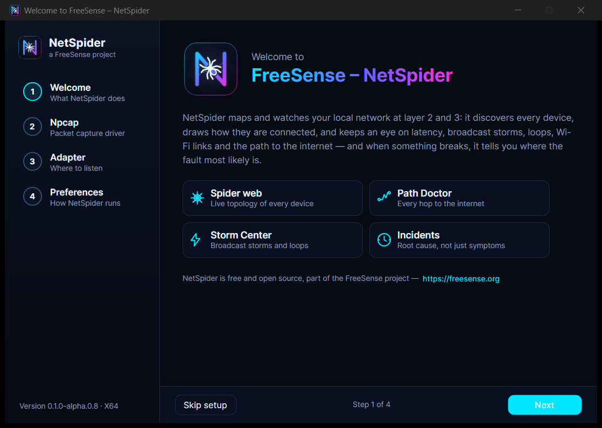 | 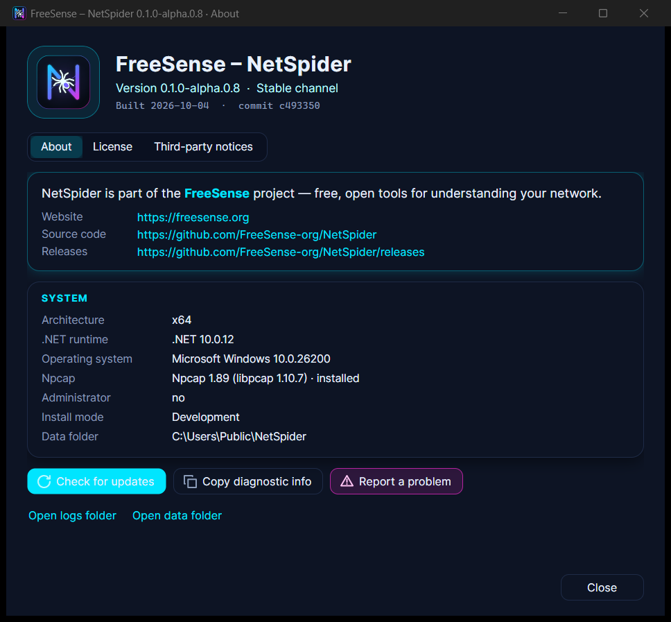 |
| 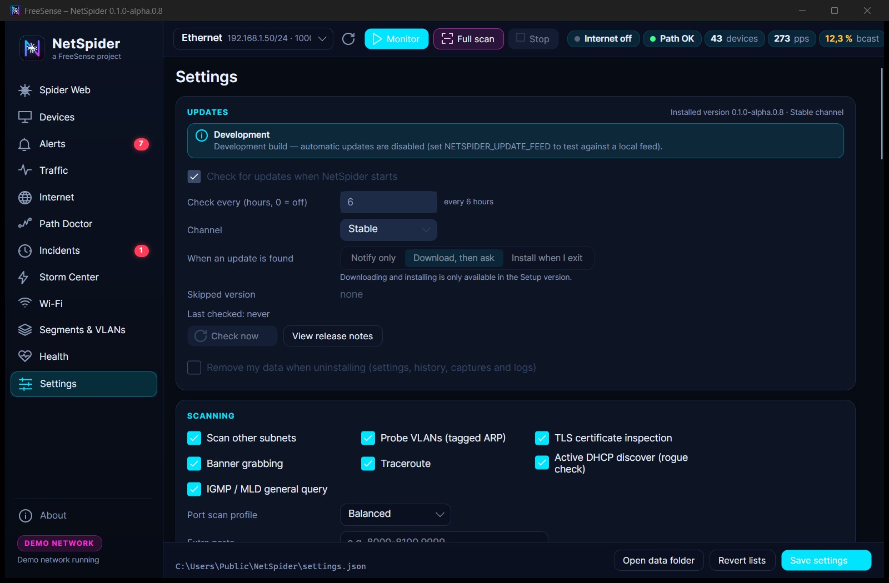 | 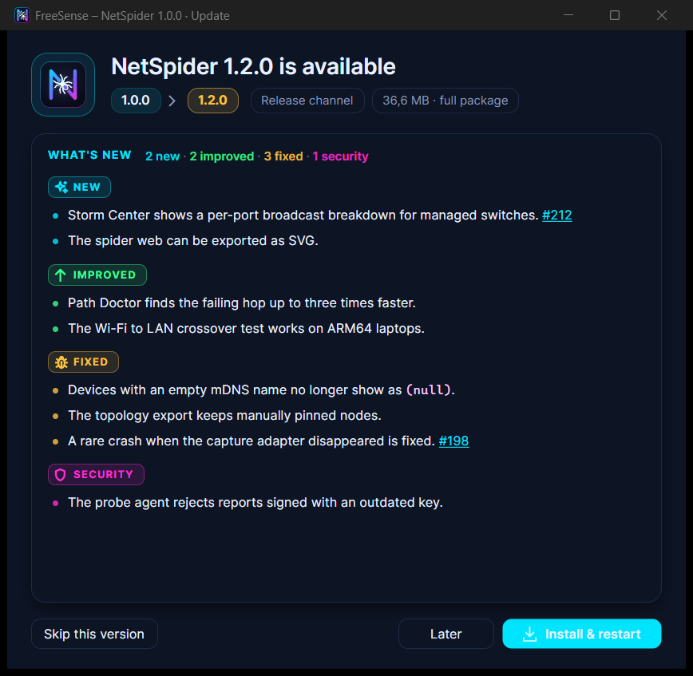 |

## Building from source
- Windows 10/11 and the .NET 10 SDK (the published app is self-contained, so end users need no .NET).
- [Npcap](https://npcap.com/#download), installed with **"WinPcap API-compatible mode"**. It is required for capture, MAC-level latency and frame injection.
- Administrator rights. Release builds request elevation automatically.
- For Wi-Fi scanning, Windows Location access must be allowed for desktop apps.

## Build, run and test
```powershell
dotnet build NetworkScan.slnx
dotnet run --project src/NetSpider.App                 # real scanning (Npcap + admin)
dotnet run --project src/NetSpider.App -- --demo       # simulated 43-device network, no Npcap needed
dotnet test NetworkScan.slnx
```
In the app, pick an adapter and press **Monitor** to start passive capture, path monitoring and live latency. Then press **Full scan** to run every probe.

**Build installers locally.** This writes the Setup.exe, portable zip, MSI and probe zips for every architecture to `artifacts/<version>/`:
```powershell
./build/release.ps1 -Version 1.0.0 [-Rids win-x64,win-arm64,win-x86] [-SkipTests]
```
**Versions and releases come from [CHANGELOG.md](CHANGELOG.md).** Every user-visible change adds a line under `[Unreleased]` ([guidelines](CHANGELOG-GUIDELINES.md)); version numbers are computed from it, never typed. GitHub Actions build all three architectures and publish the installers and the update feed as a GitHub release of this repository:
- **Pre-release (automatic):** every merge to `main` with unreleased entries is published as `v<next>-pre.<n>` to the Pre-release channel.
- **Release:** run the *Release* workflow. It opens the PR `chore(release): vX.Y.Z`; merging it tags and publishes the release to the Release and Pre-release channels.

Contributing: see [CONTRIBUTING.md](CONTRIBUTING.md) and [AGENTS.md](AGENTS.md).

**Probe agent** (Windows or Raspberry Pi):
```powershell
dotnet publish src/NetSpider.Probe -c Release -r win-x64     --self-contained -p:PublishSingleFile=true
dotnet publish src/NetSpider.Probe -c Release -r linux-arm64 --self-contained -p:PublishSingleFile=true
```

## Project layout
| Project | Responsibility |
|---|---|
| `NetSpider.Core` | Models, contracts, in-memory stores, frame builder |
| `NetSpider.Capture` | Npcap capture and injection, traffic counters, pcapng writer and recorder |
| `NetSpider.Discovery` | L2/L3 sweeps and parsers, service and vendor probes, SNMP (incl. port counters), gateway audit |
| `NetSpider.Fingerprint` | MAC-vendor database, classifier, vendor-logo scraper |
| `NetSpider.Diagnostics` | Orchestrator, latency engine, topology, anomaly engine, Path Doctor and incidents, Storm Center, AP health, internet monitor, probe-agent hub, dual-interface self-test |
| `NetSpider.Wifi` | Native WLAN API scanner and link monitor |
| `NetSpider.Export` | SQLite history and incidents, exporters, notifiers |
| `NetSpider.App` | Avalonia UI and the SkiaSharp spider-web graph |
| `NetSpider.Probe` | Cross-platform remote probe agent |

## Honest limits
- **Device↔device latency.** One PC cannot time two other devices directly. NetSpider measures it where it can: SNMP DISMAN-PING, passive TCP handshakes, and probe agents. Elsewhere it estimates it along the topology path, and the UI shows which is which.
- **VLAN tags.** Windows NICs usually strip 802.1Q tags, so VLANs are learned from LLDP, CDP and SNMP.
- **Unmanaged switches.** They have no IP, so NetSpider infers them and judges them through the devices behind them.

## License
[MIT](LICENSE) © FreeSense.org
